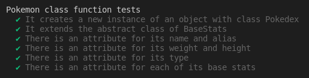
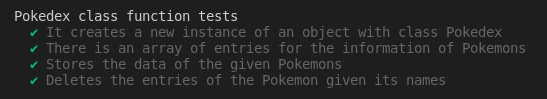
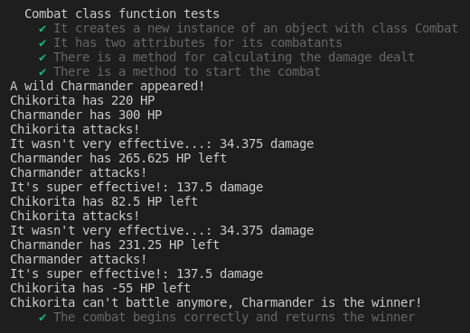
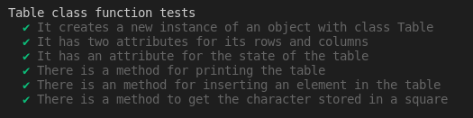
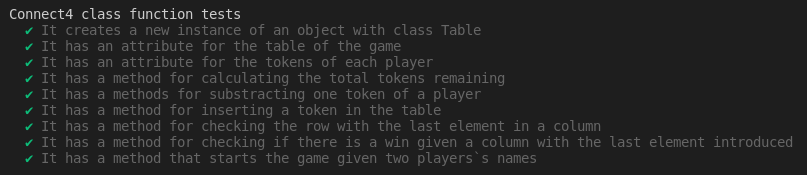
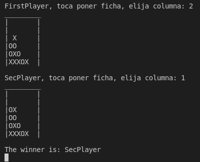

# Practica 5: Objetos, clases e interfaces
El objetivo de esta práctica es la resolución de una serie de ejercicios de programación para aprender en profundidad los objetos, clases e interfaces del lenguaje TypeScript.

# Ejercicios
Todos los ejercicios se encuentran bajo el directorio `./src` del proyecto, cada uno en su carpeta correspondiente `ejercicio-n`. Las pruebas creadas para cada uno de los ejercicios se encuentran bajo `./test`, siguiendo la metodología de desarrollo TDD. 

Debido a que cada actividad implica el desarrollo de diferentes clases, el código fuente de cada una estará alojado en ficheros independientes.

## Ejercicio - 1 | Pokedex
Se propone la creación de una `Pokedex`, que almacene la información relativa a distintos `Pokemon`. Para cada Pokemon, se almacenará la información relativa a:
* Nombre del Pokemon
* Peso y altura
* Tipo
* Estadísticas básicas, incluyendo: ataque, defensa, velocidad, y vida (HP).

Bajo esta premisa, se decide por la implementación de dos clases diferentes, una clase `Pokemon`, que se encargará de almacenar la información como atributos de los Pokemons, y una clase `Pokedex`, que guardará esta información como un tipo `entry`.

### Clase Pokemon
En primer lugar, desarrollaremos algunas pruebas para el código de la clase `Pokemon`:
```ts
describe('Pokemon class function tests', () => {
  let pikachu = new Pokemon("Pikachu", "typeElectric", 20, 5, 55, 40, 90, 35, 'Ash');
  let eevee = new Pokemon("Eevee", "typeElectric", 20, 5, 55, 40, 90, 35);

  it('It creates a new instance of an object with class Pokedex', () => {
    expect(pikachu).to.be.instanceOf(Pokemon);
  });

  it('It extends the abstract class of BaseStats', () => {
    expect(Pokemon.prototype).to.be.instanceOf(BaseStats);
  });

  it('There is an attribute for its name and alias', () => {
    expect([pikachu.getName(), pikachu.getAlias()]).to.be.eql(['Pikachu', 'Ash']);
    expect([eevee.getName(), eevee.getAlias()]).to.be.eql(['Eevee', 'Este pokemon no tiene un mote']);
  });

  it('There is an attribute for its weight and height', () => {
    expect([pikachu.getWeight(), pikachu.getHeight()]).to.be.eql([20, 5]);
  });

  it('There is an attribute for its type', () => {
    expect(pikachu.getType()).to.be.equal('typeElectric');
  });

  it('There is an attribute for each of its base stats', () => {
    expect([pikachu.getAttack(), pikachu.getDefense(), pikachu.getSpeed(),
      pikachu.getHitPoints()]).to.be.eql([55, 40, 90, 35]);
  });
});
```
La instancia de un objeto de la clase Pokemon requerirá de la definición de un nombre para el Pokemon, su tipo, peso, altura y estadísticas base. Además, un atributo opcional nos permitirá asignar un mote al Pokemon, que en caso de no ser especificado, el getter devolverá una cadena 'Este pokemon no tiene mote'.

Además, el tipo del Pokemon será un tipo de datos pokeType, que será una cadena de valores predefinidos para cada uno de los tipos disponibles, siendo estos agua, fuego, planta, eléctrico y normal.

De esta manera, pasamos al desarrollo del código de nuestras clases:
```ts
/**
 * Type to define the types of the different Pokemons.
 */
export type pokeType = "typeFire" | "typeWater" | "typeElectric" | "typePlant" | "typeNormal";
```
Se observa la definición del tipo de datos pokeType, que nos permitirá asignar a los Pokemons a sus tipos correspondientes. Además, para la implementación de la estadísticas base, se utilizará la una clase abstracta `BaseStats`, que se encargará de definir las estadísticas que heredará la clase `Pokemon`. Esto podría ser conveniente en el caso de que, por ejemplo, se quisiera implementar otra clase distinta como `Digimon` que requiriera de estas estadísticas comunes. La definición de esta clase abstracta es la siguiente:
```ts
/**
 * Abstract class that describes a set of base stats with attack,
 * defense, speed and HP stats. It implements getters and setters
 * to modify its attributes.
 */
export abstract class BaseStats {
  constructor(protected attack: number, protected defense: number,
    protected speed: number, protected hitPoints: number) {
  }

  public getAttack(): number {
    return this.attack;
  }

  public getDefense(): number {
    return this.defense;
  }

  public getSpeed(): number {
    return this.speed;
  }

  public getHitPoints(): number {
    return this.hitPoints;
  }

  public setAttack(value: number) {
    this.attack = value;
  }

  public setDefense(value: number) {
    this.defense = value;
  }

  public setSpeed(value: number) {
    this.speed = value;
  }

  public setHitPoints(value: number) {
    this.hitPoints = value;
  }
}
```
Como se ha comentado, nuestra clase `Pokemon` heredará los atributos de `BaseStats` e implementará sus propios atributos: su nombre, el tipo, su peso y su altura:
```ts
/**
 * Class Pokemon that stores the information related to the Pokemon
 * and extends BaseStats for the Pokemons.
 */
export class Pokemon extends BaseStats {
  private name: string;
  private alias?: string;
  private type: pokeType;
  private weight: number = 0;
  private height: number = 0;

  constructor(name: string, type: pokeType, weight: number, height: number,
      attack: number, defense: number, speed: number, hitPoints: number, alias?: string) {
    super(attack, defense, speed, hitPoints);
    this.name = name;
    this.type = type;
    this.weight = weight;
    this.height = height;
    this.alias = alias;
  }

  public getName(): string {
    return this.name;
  }

  public getAlias(): string {
    if (this.alias) {
      return this.alias;
    }
    return "Este Pokemon no tiene un mote";
  }

  public setAlias(name: string) {
    this.alias = name;
  }

  public getType(): pokeType {
    return this.type;
  }

  public getWeight(): number {
    return this.weight;
  }

  public getHeight(): number {
    return this.height;
  }
}
```
Se pone especial atención al atributo alias que, en el caso de no estar definido, si el usuario utiliza su getter recibirá la cadena 'Este Pokemon no tiene mote'.

Una vez definida nuestra clase Pokemon, ejecutamos los tests para observar su correcta implementación.



### Clase Pokedex
La clase Pokedex definirá una serie de métodos y atributos para almacenar la información respectiva de los Pokemons, a través de un tipo de datos `entryPokedex`, que no es más que una tupla donde se almacenará su nombre, tipo, peso, altura y estadísticas base:
```ts
**
 * Stores an entry with the information related to Pokemons
 */
type entryPokedex = [name: string, type: pokeType, weight: number, height: number,
    attack: number, defense: number, speed: number, hitPoints: number];
```
En primer lugar, diseñaremos las pruebas para el código de nuestra clase:
```ts

describe('Pokedex class function tests', () => {
  let pokedex = new Pokedex(["Eevee", "typeNormal", 20, 5, 55, 50, 55, 55]);

  it('It creates a new instance of an object with class Pokedex', () => {
    expect(pokedex).to.be.instanceOf(Pokedex);
  });

  it('There is an array of entries for the information of Pokemons', () => {
    expect("entries" in pokedex).to.be.true;
    expect(pokedex.entries).to.be.eql([["Eevee", "typeNormal", 20, 5, 55, 50, 55, 55]]);
  });

  it('Stores the data of the given Pokemons', () => {
    let pikachu = new Pokemon("Pikachu", "typeElectric", 20, 5, 55, 40, 90, 35);
    let charmander = new Pokemon("Charmander", "typeFire", 20, 5, 55, 40, 90, 35);
    let bulbasur = new Pokemon("Bulbasur", "typePlant", 20, 5, 55, 50, 55, 55);
    pokedex.storePokemon(pikachu, charmander, bulbasur);

    expect(pokedex.entries).to.be.eql([
      ["Eevee", "typeNormal", 20, 5, 55, 50, 55, 55],
      ["Pikachu", "typeElectric", 20, 5, 55, 40, 90, 35],
      ["Charmander", "typeFire", 20, 5, 55, 40, 90, 35],
      ["Bulbasur", "typePlant", 20, 5, 55, 50, 55, 55]]);
  });

  it('Deletes the entries of the Pokemon given its names', () => {
    pokedex.deletePokemon("Pikachu", "Eevee");
    expect(pokedex.entries).to.be.eql([
      ["Charmander", "typeFire", 20, 5, 55, 40, 90, 35],
      ["Bulbasur", "typePlant", 20, 5, 55, 50, 55, 55]]);
  });
});
```
La Pokedex se puede instanciar sin entradas, o con algunas ya definidas. Se implementarán métodos para almacenar información respecto a unos Pokemons dados, y eliminar entradas de la Pokedex según los nombres de los Pokemons.

La implementación del código de la clase `Pokedex` es la siguiente:
```ts
/**
 * Class Pokedex that stores the entries with information about Pokemons
 */
export class Pokedex {
  public entries: entryPokedex[] = [];

  constructor(...entries: entryPokedex[]) {
    entries.forEach((entry) => {
      this.entries.push(entry);
    });
  }

  /**
   * Given certain Pokemons, stores the information related to them as an entry
   * @param pokemons Pokemons whose entries want to be added
   */
  public storePokemon(...pokemons: Pokemon[]): void {
    pokemons.forEach((pokemon) => {
      this.entries.push([pokemon.getName(), pokemon.getType(), pokemon.getWeight(), pokemon.getHeight(),
        pokemon.getAttack(), pokemon.getDefense(), pokemon.getSpeed(), pokemon.getHitPoints()]);
    });
  }

  /**
   * Given certain names of Pokemons, if the Pokemon has an entry,
   * said entry is deleted from the Pokedex
   * @param pokemons Names of the Pokemons whose entries want to be deleted
   */
  public deletePokemon(...pokemons: string[]): void {
    pokemons.forEach((pokemon) => {
      this.entries.forEach((entry, index) => {
        if (entry[0] == pokemon) {
          this.entries.splice(index, 1);
        }
      });
    });
  }
}
```
El atributo principal de la clase será un array `entries` de entradas `entryPokedex`, que almacenará toda la información de los Pokemons. El constructor de la clase podrá recibir una serie de entradas de la Pokedex con las que se inicializa. El método `push` permitirá añadir nuevos elementos al array.

La función `storePokemon` obtendrá, dado una serie de objetos del tipo Pokemon, los datos relativos a estos y los almacenará como entradas dentro del array `entries` con su nombre, tipo, altura, peso y estadísticas básicas.

Por último, al método `deletePokemon` se le pasará como argumento una serie de nombres de Pokemons y, si existe una entrada de algún Pokemon con dicho nombre, la entrada correspondiente al mismo será eliminada gracias a `splice`. 

Tras la implementación de la clase, la ejecución de las pruebas mostrará el correcto funcionamiento de la misma:



### Clase Combat
Se propone además el desarrollo de una clase `Combat`, que simulará el combate entre dos Pokemons. Dicha clase será construida con dos oponentes, y el combate se iniciará mediante `start`. El método se basará en:
* Se realizarán ataques entre los contrincantes hasta que el daño sufrido por uno sea igual o superior a su HP.
* Se considerará que el primero de los constrincantes de la clase `Combat` siempre será el primero en atacar.
* La evolución del combate se mostrará por pantalla, mostrando tras cada ataque el estado del HP del contrincante.

En primer lugar, implementaremos las pruebas de la clase `Combat`:
```ts
describe('Combat class function tests', () => {
  let pikachu = new Pokemon("Chikorita", "typePlant", 20, 5, 55, 40, 90, 220, 'Ash');
  let charmander = new Pokemon("Charmander", "typeFire", 20, 5, 55, 40, 90, 300);
  let combat = new Combat(pikachu, charmander);

  it('It creates a new instance of an object with class Combat', () => {
    expect(combat).to.be.instanceOf(Combat);
  });

  it('It has two attributes for its combatants', () => {
    expect([combat.firstPokemon, combat.secondPokemon]).to.be.eql([pikachu, charmander]);
  });

  it('There is a method for calculating the damage dealt', () => {
    expect("dmgResult" in combat).to.be.true;
  });

  it('There is a method to start the combat', () => {
    expect("start" in combat).to.be.true;
  });

  it('The combat begins correctly and returns the winner', () => {
    expect(combat.start()).to.be.equal("Charmander");
  });
});
```
En este caso, las pruebas comprueban la existencia de los atributos y métodos correspondientes. El método `start` devolverá así el ganador del combate.

Implementaremos a continuación la clase `Combat`:
* En primer lugar, utilizaremos unas constantes para determinar el bonus de efectividad que se empleará para calcular el daño realizado por los ataques de los Pokemons dependiendo de su tipo. Además, asignaremos un Pokemon por defecto `MissignNo`.

```ts
/**
 * Constants to define the bonus effectiveness of Pokemon`s attacks
 */
const veryEffective = 2;
const aNeutral = 1;
const notVeryEffective = 0.5;

const missingNo =
    new Pokemon("MissingNo", "typeNormal", 10, 5, 50, 50, 20, 50);
```

* Los atributos de la clase se corresponderán con los oponentes del combate, y el constructor asignará a los mismos.

```ts
/**
 * Class Combat that defines a combat between two Pokemons.
 * It implements the methods to start the combat and calculate
 * the results.
 */
export class Combat {
  public firstPokemon: Pokemon = missingNo;
  public secondPokemon: Pokemon = missingNo;

  constructor(firstPokemon: Pokemon, secondPokemon: Pokemon) {
    this.firstPokemon = firstPokemon;
    this.secondPokemon = secondPokemon;
  }
 ```

* Un método privado `dmgResult` permitirá calcular el daño realizado por el Pokemon atacante al oponente dependiendo de su stat de ataque, el stat de defensa del contricante, y la ventaja de tipo correspondiente a `pokeType`. En este caso, el tipo normal se considerará con una ventaja neutral sobre el resto de tipos.

```ts
  /**
   * Calculates the damage dealt by the attackPkm to the defendPkm,
   * based in the types of both Pokemons and the attack and defense stats.
   * @param attackPkm Pokemon who is attacking.
   * @param defendPkm Pokemon who receives the attack.
   * @returns The damage dealt by the attackPkm.
   */
  private dmgResult(attackPkm: Pokemon, defendPkm: Pokemon): number {
    let typeAdvantage = 0;
    switch (attackPkm.getType()) {
      case "typeFire":
        if (defendPkm.getType() == "typeFire" || defendPkm.getType() == "typeWater") {
          typeAdvantage = notVeryEffective;
        } else if (defendPkm.getType() == "typePlant") {
          typeAdvantage = veryEffective;
        } else {
          typeAdvantage = aNeutral;
        }
        break;
      case "typeWater":
        if (defendPkm.getType() == "typeWater" || defendPkm.getType() == "typePlant" ||
            defendPkm.getType() == "typeElectric") {
          typeAdvantage = notVeryEffective;
        } else if (defendPkm.getType() == "typeFire") {
          typeAdvantage = veryEffective;
        } else {
          typeAdvantage = aNeutral;
        }
        break;
      case "typeElectric":
        if (defendPkm.getType() == "typeElectric") {
          typeAdvantage = notVeryEffective;
        } else if (defendPkm.getType() == "typeWater") {
          typeAdvantage = veryEffective;
        } else {
          typeAdvantage = aNeutral;
        }
        break;
      case "typePlant":
        if (defendPkm.getType() == "typePlant" || defendPkm.getType() == "typeFire") {
          typeAdvantage = notVeryEffective;
        } else if (defendPkm.getType() == "typeWater") {
          typeAdvantage = veryEffective;
        } else {
          typeAdvantage = aNeutral;
        }
        break;
      case "typeNormal":
        typeAdvantage = aNeutral;
        break;
      default:
        console.log("Error: tipo " + attackPkm.getType() + "no esperado.\n");
        return 0;
    }
    let dmg = (50 * (attackPkm.getAttack() / defendPkm.getDefense()) * typeAdvantage);
    if (typeAdvantage == veryEffective) {
      console.log(`It's super effective!: ${dmg} damage`);
    } else if (typeAdvantage == notVeryEffective) {
      console.log(`It wasn't very effective...: ${dmg} damage`);
    } else {
      console.log(`${dmg} damage`);
    }

    return dmg;
  }
```

* Por último, el método `start` realiza la simulación del combate, donde se alternan los turnos entre el pokemon atacante `attackPkm` y el contrincante `defendPkm`. Se inicializa mostrando los HPs de ambos y, dentro de un bucle, el primer Pokemon ataca al contrincante, calculando el daño realizado mediante el método `dmgResult` y restándo el daño al HP. Por cada ataque, el HP del oponente se mostrará por pantalla, asegurando que, en el caso de que llegue a 0, el combate termina, declarando como ganador al atacante de ese turno. Por cada iteración del combate, los roles entre atacante y contricante se irán alternando, hasta que alguno de los HPs de ambos llegue a 0.

```ts
  /**
   * Method that simulates and initiates the battle between the Pokemons.
   * @returns The winner of the combat, given as a string.
   */
  public start(): string {
    let attackPkm = this.firstPokemon;
    let defendPkm = this.secondPokemon;
    let winnerPkm: string;

    // Combat simulation
    console.log(`A wild ${defendPkm.getName()} appeared!`);
    console.log(`${attackPkm.getName()} has ${attackPkm.getHitPoints()} HP`);
    console.log(`${defendPkm.getName()} has ${defendPkm.getHitPoints()} HP`);

    while (true) {
      console.log(`${attackPkm.getName()} attacks!`);
      let dmg = this.dmgResult(attackPkm, defendPkm);
      defendPkm.setHitPoints(defendPkm.getHitPoints() - dmg);
      console.log(`${defendPkm.getName()} has ${defendPkm.getHitPoints()} HP left`);

      if (defendPkm.getHitPoints() <= 0) {
        console.log(`${defendPkm.getName()} can't battle anymore, ${attackPkm.getName()} is the winner!`);
        winnerPkm = attackPkm.getName();
        break;
      } else {
        let aux = defendPkm;
        defendPkm = attackPkm;
        attackPkm = aux;
      }
    }
    return winnerPkm;
  }
}
```

De esta manera, si ejecutamos ahora las pruebas, veremos una traza del combate con dos Pokemons definidos, así como los tests superados correctamente:



Se completaría así el desarrollo del primer ejercicio.

## Ejercicio - 2 | Conecta 4
En este siguiente ejercicio, se propone la creación de una jerarquía de clases necesarias para implementar el juego Conecta 4, teniendo en cuenta las siguientes funcionalidades:
* El juego comienza con el Jugador 1 colocando la primera ficha y, en turnos sucesivos, debe ir alternándose con el Jugador 2. Se deberá mostrar por consola a qué jugador le toca colocar una ficha.
* Si un jugador intenta colocar una ficha en una columna completa, se mostrará un mensaje informando de que la columna está completa y se le permitirá seleccionar otra columna para colocar la ficha. Lo anterior debe repetirse hasta que el jugador coloque su ficha.
* Una vez que el jugador correspondiente haya colocado una ficha, debe mostrarse por la consola el estado del tablero.
* Cuando alguno de los dos jugadores gane, se debe informar de lo anterior en la consola y terminar el juego.

### Clase Table
En primer lugar, diseñaremos una clase `Table`, que será la encargada de almacenar el estado del tablero e implementar métodos para poder insertar fichas en el mismo, mostrar por pantalla el estado del tablero, obtener los atributos como el número de columnas o filas, o la ficha designada en alguna de las casillas. Para ello, desarrollaremos primero las pruebas del código:

```ts
describe('Table class function tests', () => {
  let table = new Table(4, 5);
  let emptyTable = new Table(0, 0);

  it('It creates a new instance of an object with class Table', () => {
    expect(table).to.be.instanceOf(Table);
  });

  it('It has two attributes for its rows and columns', () => {
    expect([table.getRows(), table.getColumns()]).to.be.eql([4, 5]);
    expect([emptyTable.getRows(), emptyTable.getColumns()]).to.be.eql([0, 0]);
  });

  it('It has an attribute for the state of the table', () => {
    expect(table.getState()).to.be.eql([
      [' ', ' ', ' ', ' ', ' '],
      [' ', ' ', ' ', ' ', ' '],
      [' ', ' ', ' ', ' ', ' '],
      [' ', ' ', ' ', ' ', ' ']]);
    expect(emptyTable.getState()).to.be.eql([]);
  });

  it('There is a method for printing the table', () => {
    expect("print" in table).to.be.true;
  });

  it('There is an method for inserting an element in the table', () => {
    table.insertTable(0, 0, 'X');
    emptyTable.insertTable(1, 1, 'X');
    expect("insertTable" in table).to.be.true;
    expect(table.getState()).to.be.eql([
      ['X', ' ', ' ', ' ', ' '],
      [' ', ' ', ' ', ' ', ' '],
      [' ', ' ', ' ', ' ', ' '],
      [' ', ' ', ' ', ' ', ' ']]);
    expect(emptyTable.getState()).to.be.eql([]);
  });

  it('There is a method to get the character stored in a square', () => {
    expect(table.getChar(0, 0)).to.be.equal("X");
    expect(emptyTable.getChar(0, 0)).to.be.equal(undefined);
  });
});
```
Se ha tenido en cuenta el caso donde nuestro tablero, que no es más que un array bidimensional, se inicializa con un número de columnas y filas a 0, siendo en este caso un array vacío.

La implementación de la clase `Table` es el siguiente:

```ts
/**
 * Class Table that defines a bidimensional array with attributes for
 * its number of columns and rows. Implements methods to insert tokens
 * and print the current state of the game.
 */
export class Table {
  private numRows: number = 0;
  private numCols: number = 0;
  private stateTable: string[][] = [];

  constructor(numRows: number, numCols: number) {
    this.numRows = numRows;
    this.numCols = numCols;
    this.stateTable = new Array(numRows).fill(' ').map(() => new Array(numCols).fill(' '));
  }

  public getRows(): number {
    return this.numRows;
  }

  public getColumns(): number {
    return this.numCols;
  }

  public getState(): string[][] {
    return this.stateTable;
  }

  /**
   * Prints the state of the board with its values in the squares.
   */
  public print(): void {
    for (let i = 0; i < this.numCols + 2; i++) {
      process.stdout.write("_");
    }
    process.stdout.write("\n");
    for (let i = 0; i < this.numRows; i++) {
      process.stdout.write("|");
      for (let j = 0; j < this.numCols; j++) {
        process.stdout.write(`${this.stateTable[i][j]}`);
      }
      process.stdout.write("|\n");
    }
    process.stdout.write("\n");
  }

  /**
   * Inserts in the square defined by row and column the character given.
   * @param row Index in the rows.
   * @param col Index in the columns.
   * @param char Character to insert into the square.
   */
  public insertTable(row: number, col: number, char: string): void {
    if (row < this.numRows && row >= 0 &&
        col < this.numCols && col >= 0) {
      this.stateTable[row][col] = char;
    }
  }

  /**
   * Get the character in the square defined by row and columns.
   * @param row Index of the rows.
   * @param col Index of the columns.
   * @returns The character in the designated square.
   */
  public getChar(row: number, col: number): string | undefined {
    if (row >= this.numRows || col >= this.numCols || row < 0 || col < 0) {
      return undefined;
    }
    return this.stateTable[row][col];
  }
}
```
Como ya hemos comentado, la clase `Table` contiene los atributos `numRows` y `numCols`, que almacenan el número de filas y columnas del tablero, y `stateTable`, que definirá el array bidimensional que guardará los caracteres que representan fichas. 

Un objeto de la clase `Table` deberá definirse con un número de filas y columnas, siendo el constructor el que inicializa el array `stateTable`, que en un principio se llenará de espacios en blanco. Los métodos getters permitirán acceder a los atributos, teniendo especial cuidado con `getChar`, donde, en el caso de que se indique un número de columna o fila fuera del rango del tablero, retornará `undefined`. El método `print` imprimirá por pantalla el estado del tablero, e `insertTable` almacenará en la casilla indicada por su fila y columna el carácter `char`.

De esta manera, si ejecutamos las pruebas del código, veremos el correcto funcionamiento de la clase:



### Clase Connect4
Definiremos la clase `Connect4`, que será la encargada de empezar la partida, definir las reglas del juego, el tablero y sus fichas, además de algunos métodos para acceder a los atributos de la clase.

Desarrollaremos así algunas pruebas para la misma:
```ts
describe('Connect4 class function tests', () => {
  let connect4 = new Connect4();

  it('It creates a new instance of an object with class Table', () => {
    expect(connect4).to.be.instanceOf(Connect4);
  });

  it('It has an attribute for the table of the game', () => {
    expect(connect4.getTable()).to.be.eql(new Table(6, 7));
  });

  it('It has an attribute for the tokens of each player', () => {
    expect(connect4.getTokensFirstPlayer()).to.be.equal(21);
    expect(connect4.getTokensSecPlayer()).to.be.equal(21);
  });

  it('It has a method for calculating the total tokens remaining', () => {
    expect(connect4.getTotalTokens()).to.be.equal(42);
  });

  it('It has a methods for substracting one token of a player', () => {
    connect4.subTokensFirstPlayer();
    connect4.subTokensSecPlayer();
    expect(connect4.getTokensFirstPlayer()).to.be.equal(20);
    expect(connect4.getTokensSecPlayer()).to.be.equal(20);
    expect(connect4.getTotalTokens()).to.be.equal(40);
  });

  it('It has a method for inserting a token in the table', () => {
    connect4.insertToken(1, 'X');
    connect4.insertToken(-1, 'X');
    expect(connect4.getTable().getState()).to.be.eql([
      [' ', ' ', ' ', ' ', ' ', ' ', ' '],
      [' ', ' ', ' ', ' ', ' ', ' ', ' '],
      [' ', ' ', ' ', ' ', ' ', ' ', ' '],
      [' ', ' ', ' ', ' ', ' ', ' ', ' '],
      [' ', ' ', ' ', ' ', ' ', ' ', ' '],
      ['X', ' ', ' ', ' ', ' ', ' ', ' ']]);
  });

  it('It has a method for checking the row with the last element in a column', () => {
    expect(connect4.rowCharTop(1)).to.be.equal(5);
  });

  it('It has a method for checking if there is a win given a column with the last element introduced', () => {
    expect(connect4.checkWinCondition(1)).to.be.false;
    connect4.insertToken(1, 'X');
    connect4.insertToken(1, 'X');
    connect4.insertToken(1, 'X');
    connect4.insertToken(-1, 'X');
    expect(connect4.checkWinCondition(1)).to.be.true;
    expect(connect4.getTable().getState()).to.be.eql([
      [' ', ' ', ' ', ' ', ' ', ' ', ' '],
      [' ', ' ', ' ', ' ', ' ', ' ', ' '],
      ['X', ' ', ' ', ' ', ' ', ' ', ' '],
      ['X', ' ', ' ', ' ', ' ', ' ', ' '],
      ['X', ' ', ' ', ' ', ' ', ' ', ' '],
      ['X', ' ', ' ', ' ', ' ', ' ', ' ']]);
  });

  it('It has a method that starts the game given two players`s names', () => {
    expect("start" in connect4).to.be.true;
  });
});
```
De esta manera, la clase `Connect4` definirá como atributo un objeto de la clase `Table`, que representará el tablero de 6 filas y 7 columnas necesario. A su vez, implementará un atributo `tokens`, que representará una tupla con el número de fichas que ambos jugadores disponen, y que se irá decrementando a medida que el juego avance. El método de `insertToken` permitirá introducir las fichas en las columnas, no incluyéndose en el caso de que la columna no fuera válida.

Pasamos así a la implementación del código de la clase:
```ts
/**
 * Class Connect4 to initiate the attributes of a game of Connect4,
 * with methods to start the game and set the rules.
 */
export class Connect4 {
  private table: Table;
  private tokens: [number, number];

  constructor() {
    this.table = new Table(6, 7);
    this.tokens = [21, 21];
  }
```
Como ya comentamos anteriormente, el constructor de la clase se encargará de inicializar el atributo `table`, que será un tablero de 6 filas y 7 columnas, y las fichas correspondientes a cada jugador, que serán 42 en total.

```ts
  public getTable(): Table {
      return this.table;
  }

  /**
   * Gets the remaining tokens of the first player.
   * @returns The remaining tokens.
   */
  public getTokensFirstPlayer(): number {
    return this.tokens[0];
  }

  /**
   * Gets the remaining tokens of the second player.
   * @returns The remaining tokens.
   */
  public getTokensSecPlayer(): number {
    return this.tokens[1];
  }

  /**
   * Gets the total tokens of both players.
   * @returns The total tokens left in-game.
   */
  public getTotalTokens(): number {
    return this.tokens[0] + this.tokens[1];
  }

  /**
   * Substracts a token from the first player.
   */
  public subTokensFirstPlayer(): void {
    this.tokens[0]--;
  }

  /**
   * Substracts a token from the second player.
   */
  public subTokensSecPlayer(): void {
    this.tokens[1]--;
  }
```
Se definen a continuación algunos getters para los atributos, y métodos para la obtención de las fichas individuales de los jugadores, además de `subTokensFirstPlayer` y `subTokensSecPlayer` para restar el número de fichas a cada uno.

```ts
public insertToken(numCol: number, token: string): boolean {
    let inserted = false;
    let j = numCol - 1;
    let i = 5;
    while (i >= 0) {
      if (this.table.getChar(i, j) == ' ') {
        this.table.insertTable(i, j, token);
        inserted = true;
        break;
      }
      i--;
    }
    return inserted;
  }
```
La función `insertToken` permitirá introducir una ficha indicada en `token` en la columna designada como argumento. Aquí, la función analiza las casillas de la columna y, en el caso de encontrar una en blanco, empezando desde la más profunda, almacenará el `token` mediante `insertTable`. De esta manera, la función retornará un booleano para indicar que se ha introducido la ficha correctamente o, en el caso contrario, si no se ha encontrado una fila vacía.

```ts
  /**
   * Given a column, returns the number of the row with the last character inserted.
   * @param numCol Number of the column to check the last token inserted.
   * @returns The number of the row.
   */
  public rowCharTop(numCol: number): number {
    let col = numCol - 1;
    let row = 0;
    while (row < 6) {
      if (this.table.getChar(row, col) == ' ') {
        row++;
      } else {
        break;
      }
    }
    return row;
  }
```
El método `rowCharTop` indicará, dado un número de columna, el número de la fila con la última ficha dispuesta en la columna. Esto lo utilizaremos más adelante como función auxiliar.

```ts
/**
   * Given a column, checks if the last token inserted connects 4 other
   * tokkens of the same player to win the game.
   * @param numCol Number of the column of the last token inserted.
   * @returns Returns true if there are 4 connected tokens.
   */
  public checkWinCondition(numCol: number): boolean {
    let col = numCol - 1;
    let row = this.rowCharTop(numCol);
    let charWin = this.table.getChar(row, col);

    let consecutives = 1;
    // Checks in the right
    while (this.table.getChar(row, col + consecutives) == charWin) {
      consecutives++;
    }
    // Checks in the left
    while (this.table.getChar(row, col - consecutives) == charWin) {
      consecutives++;
    }
    if (consecutives >= 4) {
      return true;
    }

    consecutives = 1;
    // Checks above
    while (this.table.getChar(row - consecutives, col) == charWin) {
      consecutives++;
    }
    // Checks below
    while (this.table.getChar(row + consecutives, col) == charWin) {
      consecutives++;
    }
    if (consecutives >= 4) {
      return true;
    }

    consecutives = 1;
    // Checks diagonal up-right
    while (this.table.getChar(row - consecutives, col + consecutives) == charWin) {
      consecutives++;
    }
    // Checks diagonal down-left
    while (this.table.getChar(row + consecutives, col - consecutives) == charWin) {
      consecutives++;
    }
    if (consecutives >= 4) {
      return true;
    }

    consecutives = 1;
    // Checks diagonal down-right
    while (this.table.getChar(row + consecutives, col + consecutives) == charWin) {
      consecutives++;
    }
    // Checks diagonal up-left
    while (this.table.getChar(row - consecutives, col - consecutives) == charWin) {
      consecutives++;
    }
    if (consecutives >= 4) {
      return true;
    }
    return false;
  }
```
El método `checkWinCondition` será el encargado de determinar si, al recibir una columna, la última ficha dispuesta en la misma ha desembocado en la victoria para alguno de los jugadores. De esta manera, determinaremos el número de la fila donde se dispone la ficha mediante `rowCharTop`, determinando en la variable `charWin` el carácter de la ficha a comprobar.

Se procede así a revisar, para cada una de las direcciones posibles, si se produce un encadenamiento de los caracteres de las fichas del tablero con un mínimo de 4 seguidos. En primer lugar, se comprueba los caracteres a la derecha e izquierda de la casilla, sumando a `consecutives` si es el caso, que será el contador del número de caracteres de la ficha consecutivos. Tras ello, se chequea si `consecutives` ha sumado 4 o más fichas seguidas, retornando `true` si es el caso, o continuando con las comprobaciones. Esto se repite para las direcciones superior e inferior, y ambas diagonales de la casilla. En el caso de que ninguna dirección haya podido sumar un mínimo de 4 fichas consecutivas, la función retornará `false`. Recordar que, si se intenta acceder a una casilla fuera del rango del tablero, `getChar` devolverá `undefined` y, por ello, no nos dará un error al intentar acceder a un índice fuera del array.

Por último, la función `start` iniciará la partida del conecta 4, recibiendo como argumento los nombres de los jugadores:
```ts
/**
   * Initiates the game with the names of the given players and
   * returns the winner who triggers a connection of 4 tokkens.
   * @param playerOne Name of the first player.
   * @param playerTwo Name of the second player.
   * @returns The winner of the game. If no tokens are left, its declared a draw.
   */
  public start(playerOne: string, playerTwo: string): string {
    this.table.print();
    let scanf = require('scanf');
    let connected = false;
    let winner = "";

    while (connected == false) {
      // Turn of the first player
      process.stdout.write(`${playerOne}, toca poner ficha, elija columna: `);
      let choosenCol = scanf('%d');
      // Inserts the token in the column
      let inserted = false;
      while (inserted == false) {
        inserted = this.insertToken(choosenCol, "X");
        if (inserted == false) {
          process.stdout.write(`Columna llena, por favor, elija otra: `);
          choosenCol = scanf('%d');
        }
      }
      this.subTokensFirstPlayer();
      this.table.print();
      // Checks if there is a connection of 4 tokens
      connected = this.checkWinCondition(choosenCol);
      if (connected) {
        winner = playerOne;
        break;
      }

      // Turn of second player
      process.stdout.write(`${playerTwo}, toca poner ficha, elija columna: `);
      choosenCol = scanf('%d');
      // Inserts the token in the column
      inserted = false;
      while (inserted == false) {
        inserted = this.insertToken(choosenCol, "O");
        if (inserted == false) {
          process.stdout.write(`Columna llena, por favor, elija otra: `);
          choosenCol = scanf('%d');
        }
      }
      this.subTokensSecPlayer();
      this.table.print();
      // Checks if there is a connection of 4 tokens
      connected = this.checkWinCondition(choosenCol);
      if (connected) {
        winner = playerTwo;
        break;
      }
      // If no more tokens are left
      if (this.getTotalTokens() == 0) {
        winner = "Draw";
        break;
      }
    }
    return winner;
  }
}

// To initialize a game:
// let connect4 = new Connect4();
// let winner = connect4.start("FirstPlayer", "SecPlayer");
// console.log(`The winner is: ${winner}`);
```
Para recibir los inputs del usuario, hemos utilizado el paquete `scanf`, instalado como dependencia. Esto se debe a que, en los sucesivos turnos del juego, se pedirá al usuario introducir una columna para poner su ficha. De esta manera, inicializamos `scanf` mediante `require('scanf')` y definimos un booleano `conencted`, que determinará si se ha llegado a una condición de victoria por parte de alguno de los jugadores. El bucle `while` seguirá hasta que se llegue a esta condición. Dentro del mismo, tocará el turno del primer jugador, al que se le pedirá un número de columna para introducir su ficha, en este caso simbolizadas como "X". El booleano `inserted` indicará si la ficha ha sido introducida mediante `insertToken`, que retornará `true` o `false`. Si no se ha podido insertar, se le pedirá al usuario nuevamente una columna, hasta que se introduzca la ficha correctamente, después de lo cual se resta uno al número de fichas del jugador. 

Se muestra por pantalla el nuevo estado del tablero y se comprueba si se ha llegado a la victoria en esa columna mediante `checkWinCondition` que retornará un booleano para `connected` y que, en el caso de ser `true`, declarará el ganador en `winner` y saldrá del bucle. En caso contrario, se seguirá con el turno del segundo jugador, cuyas fichas son representadas mediante "O", con los mismos pasos aplicados anteriormente. En el caso de que se acabe el número total de fichas, el ganador es declarado como una cadena `Draw`, que simboliza el empate. La función `start` retornará así el nombre del jugador que haya sido determinado como ganador.

Si ejecutamos las pruebas del código, observaremos el correcto funcionamiento del código:



Y además, se muestra la ejecución de una partida:



Se completarían así todos los ejercicios propuestos de esta práctica.
